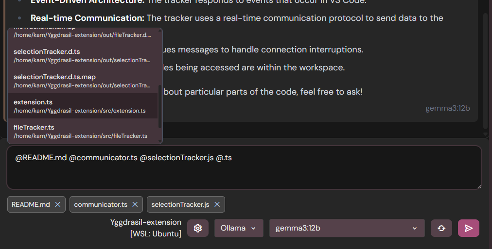
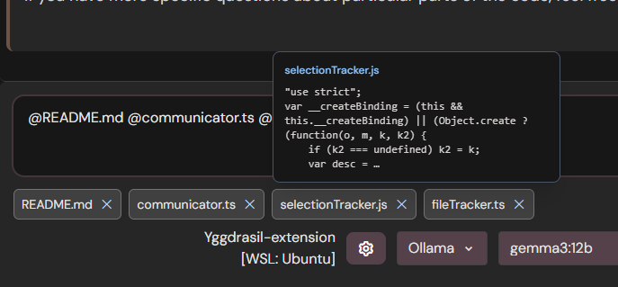

# Yggdrasil

Yggdrasil is a **local-first AI workspace** and an **agent harness**:
it can **read & write files**, **search code**, **run shell commands**, and **invoke tools**—while also supporting **parallel + branching workflows** and **stateful inline apps**.

> Core thesis: **LLMs work best with iterative workflows**

---

## What you get

### 1) Parallel + branching workflows (Heimdall tree)

Humans don’t solve problems linearly. Yggdrasil is built around **branching conversations** and **tree navigation** so you can explore tangents, test alternatives, and keep clean context boundaries.

- **Every edit is a branch** (no history loss)
- **Non-linear exploration** without context pollution
- **Search across your full chat history**

#### Demo videos

| Workflow | Demo |
| --- | --- |
| Branches overview | [▶ Watch video](docs/assets/videos/branches_overview.mp4) |
| Branching conversations | [▶ Watch video](docs/assets/videos/branching.mp4) |

### 2) AI apps

Tools can return **HTML** that renders in a sandboxed iframe _inside the chat thread_ (or in a Tool Manager overlay). This enables “AI Apps”, not just text, context from these apps is excluded from the chat:

- dashboards
- editors
- workflow runners
- file/search UIs
- generators (PDF/PPTX/media pipelines), etc.
- games?

#### AI apps demos

| Feature | Demo |
| --- | --- |
| Custom apps in chat | [▶ Watch video](docs/assets/videos/customapps.mp4) |
| Extra features overview | [▶ Watch video](docs/assets/videos/extrafeatures.mp4) |

### 4) Persistent background agent (Beta)

In desktop mode, Yggdrasil supports a persistent “global agent” loop that can run queued work in the background via the same chat/tool stack (with explicit permission gates).

### 5) A builder ecosystem (custom tools + MCP + skills)

Yggdrasil includes:

- built-in tools (file ops, search, shell, etc.)
- **custom tools** (drop-in tool folders, create your own)
- **MCP integration**
- skills (installable capability bundles)

---

## VS Code Integration

The companion VS Code extension provides seamless workspace integration:

- Access files in your VS Code workspace directly
- Insert file contents into chat using the `@` symbol
- Add selected context from IDE

<p align="start">
  
  
</p>

Get the extension from the [VS Code Marketplace](https://marketplace.visualstudio.com/items?itemName=YggdrasilAI97.yggdrasil-extension).


## The Vision Behind Yggdrasil

Born from frustration with linear LLM interfaces that fail to match human thinking patterns, Yggdrasil represents a fundamental shift in how we interact with AI systems.

### Preserving Thought History

Our conversations with AI systems contain valuable records of how we think, reason and solve problems. Yggdrasil transforms these interactions into navigable mind maps, showing how you approach any topic.

### Addressing the Documentation Crisis

Traditional programming preserved change history through version control and documentation. With AI-generated code often discarded in chat conversations, we're losing crucial development context. Yggdrasil provides proper logging and easy access to AI usage history.

### Superior Learning Tool

By encapsulating different topics into isolated branches, Yggdrasil prevents both:

- **Context pollution** for the LLM
- **Visual pollution** for the user
- **Growing token cost**

This creates cleaner, more focused learning experiences.

Our back-and-forth conversations with AI systems generate valuable data that's currently being wasted. Yggdrasil's mission is to help users better visualize and manage this conversation data, transforming ephemeral chat into persistent, navigable knowledge structures.

## Future

This project has grown a bit too much and I think it would do better as an opensource project. I see the future of Yggdrasil as a layer running on top of windows/mac/linux, an abstraction fully automated with an agent.
Each user can with a prompt, adjust the UI/UX of their app, make it more productive for themselves, or easier to use for someone with visual impairment for example.

Bespoke software, for everyone.

## Current Status

Yggdrasil is now out of beta. It is pretty stable in its main operation. If you encounter any bug or have a feature request, please open an issue on GitHub.

I would love to have feedback and contributions from the community.

---

## Project Structure

```
yggdrasil_client/
└── ygg-chat/
    ├── client/
    │   └── ygg-chat-r/     # React UI + Electron runtime + local server + tools
    ├── shared/             # Shared types/assets
    └── docs/               # Documentation
```

````md
## Getting Started (Development)

```bash
cd ygg-chat
npm install
npm run dev
```
````

- Web UI: http://localhost:5173

### Electron (desktop dev)

```bash
cd ygg-chat
npm run dev:electron
```

## Build (Windows)

```bash
cd ygg-chat/client/ygg-chat-r
npm install --workspaces=false --include=optional
npm run build:win
```

### If you run into native module issues, try:

```bash
npm --prefix client/ygg-chat-r run rebuild:client
```

### Why not MIT from day one?

We are currently using AGPL-3.0 to discourage closed-source forks/clones during the early stage.
We will revisit licensing (MIT) once the project reaches stronger maturity/traction.

# License

Licensed under the **GNU Affero General Public License v3.0 (AGPL-3.0)**. See [LICENSE](license.md). If you run a modified version as a network service, the AGPL requires you to offer the corresponding source code to users of that service.
